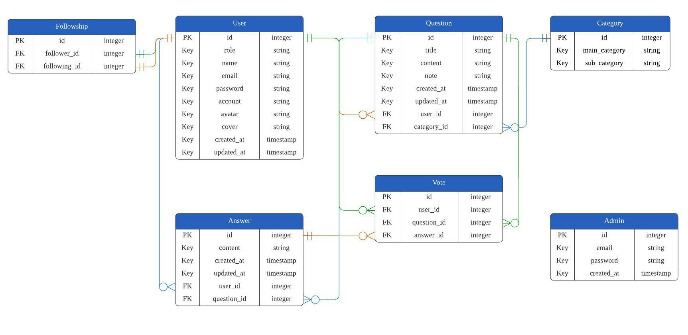

# Career Forum Backend
## Introduction
Career Forum is a forum for AC TAs, alumni and students to ask the questions and share their answers on job finding.

- Qualification for registering:
  - All AC TAs
  - All students that are at the third semester
  - Attended the the third semester and graduated from AC

## ERD


## Contents
### [Prerequisite](#prerequisite)
### [Start the Project](#start-the-project)
### [APIs](#apis)
- [User](#user)
  - [User register an account](#user-register-an-account)
  - [User login](#user-login)


### Prerequisite
- Node.js v18.12.1
- install MySQL Workbench

### Start The Project
- clone this repository
  ```
  $ git clone https://github.com/AdrieneTZ/career-forum-backend.git
  ```

- install package
  ```
  $ npm install
  ```

- create `.gitignore` and `.env` file
  ```
  $ touch .gitignore
  $ touch .env
  ```

- put `.env` and `node-modules` into `.gitignore`
  ```
  node_modules/
  .env
  ```

- follow `.env.example` to set environment variables on `.env`

- migrate database
  ```
  $ npm run migrate
  ```


### APIs
#### Local Environment Base Url:
```
http://localhost:3000/api
```
#### User
##### User register an account
  ```
  POST /users/register
  ```

  - **Requset body:**
    ```json
    {
      "role": "string" (required),
      "email": "string" (required),
      "account": "string" (required),
      "password": "string" (required),
      "confirmPassword": "string" (required)
    }
    ```

  - **Response:**
    - **Success**
      ```json
      status code: 201
      ```

    - **Incorrect data type**
       ```json
      status code: 400

      {
        "type": "Register failed",
        "title": "Incorrect datatype",
        "field_errors": {
          "role": "string",
          "email": "string",
          "account": "string",
          "password": "string",
          "confirmPassword": "string"
        }
      }
      ```

    - **Missing required data**
      ```json
      status code: 400

      {
        "type": "Register failed",
        "title": "Missing required data",
        "field_errors": {
          "role": "required",
          "email": "required",
          "account": "required",
          "password": "required",
          "confirmPassword": "required"
        }
      }
      ```


    - **Email has been used**
      ```json
      status code: 400

      {
        "type": "Register failed",
        "title": "Email is used",
        "field_errors": {
          "email": "used"
        }
      }
      ```

##### User login with an email address
  ```
  POST /users/login
  ```

  - **Requset body:**
    ```json
    {
      "email": "string" (required),
      "password": "string" (required)
    }
    ```

  - **Response:**
    - **Success**
      ```json
      status code: 200

      {
        "token": "a set of token"
      }
      ```

    - **Missing required data**
      ```json
      status code: 400

      {
        "type": "Login failed",
        "title": "Missing required data",
        "field_errors": {
          "email": "required",
          "password": "required"
        }
      }
      ```

    - **Incorrect data type**
       ```json
      status code: 400

      {
        "type": "Login failed",
        "title": "Incorrect datatype",
        "field_errors": {
          "email": "string",
          "password": "string"
        }
      }
      ```

    - **Been suspended or deleted**
      ```json
      status code: 400

      {
        "type": "Login failed",
        "title": "Been suspended or deleted",
        "field_errors": {
          "isSuspended": "true",
          "isDeleted": "true"
        }
      }
      ```

    - **Incorrect email or password**
      ```json
      status code: 400

      {
        "type": "Login failed",
        "title": "Incorrect email or password",
        "field_errors": {
          "email": "incorrect",
          "password": "incorrect"
        }
      }
      ```

    - **Unapproved user**
      ```json
      status code: 400

      {
        "type": "Login failed",
        "title": "Unapproved user",
        "field_errors": {
          "approvalStatus": "must be approved"
        }
      }
      ```


