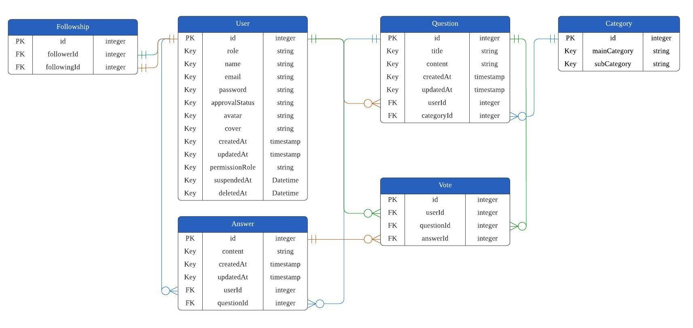

<div align="center">
<h1><b>職涯論壇 Career Forum</b></h1>
<h3>人生沒有明確的答案，<br/>
但你可以透過問答探尋你的職涯方向</h3>
<br/>
<h3><a href="https://careerforum-group.vercel.app/" target="_blank">前往我們的職涯論壇 Click to try Career Forum</a></h3>
<table>
<label>範例帳號 Try with example accounts</label><br/>
  <tr>
    <th>email</th>
    <td>user@careerforum.com</td>
    <td>admin@careerforum.com</td>
  </tr>
  <tr>
    <th>password</th>
    <td>As123456!</td>
    <td>As123456!</td>
  </tr>
</table>
<br/>
</div>

# Contents
## [Introduction](#1-introduction)
## [Career Forum Backend](#2-career-forum-backend)
## [API Documents](#3-api-documents)
## [Prerequisite](#4-prerequisite)
## [Start the Project](#5-start-the-project)


## 1. Introduction
### About Career Forum
Career Forum is a project for AC TAs, alumni and students to ask the questions and share their answers while finding jobs.

- Qualification for registering:
  - All AC TAs
  - All students that are at the third semester
  - Has Attended the the third semester and graduated from AC


## 2. Career Forum Backend
  ### Tech Stack


  ### ERD
   


## 3. API Documents
  ### Local Environment Base Url: `http://localhost:3000/api/v1`
| Entity | File |
| :------: | :----: |
| User | [user-apis.md](APIs/user-apis.md) |
| Admin | [admin-apis.md](APIs/admin-apis.md) |
| Question | [question-apis.md](APIs/question-apis.md) |
| Answer | [answer-apis.md](APIs/answer-api.md) |


## 4. Prerequisite
- Install Node.js v16.19.0
- Install MySQL Workbench

## 5. Start The Project
- clone this repository
  ```
  $ git clone https://github.com/AdrieneTZ/career-forum-backend.git
  ```

- install package
  ```
  $ npm install
  ```

- create `.gitignore` and `.env` file
  ```
  $ touch .gitignore
  $ touch .env
  ```

- put `.env` and `node-modules` into `.gitignore`
  ```
  node_modules/
  .env
  ```

- follow `.env.example` to set environment variables on `.env`

- migrate database
  ```
  $ npm run migrate
  ```

- create seed data
  ```
  $ npm run seed
  ```


